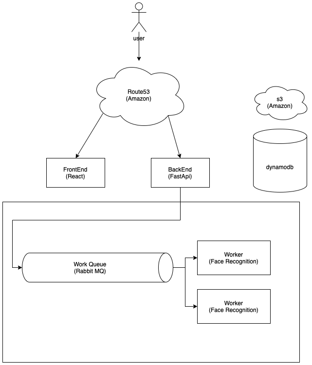

# Capstone Design1 - Video Summarizer Worker

## 다이어그램의 해당 영역을 담당합니다.



## 사용 기술

-   메세지 큐에 흘러들어오는 데이터를 입력받습니다. - RabbitMQ
-   KeyValue Database를 사용합니다. - DynamoDB
-   face recognition && face clustering - DBSCAN, face_recognition

## To start

need .env file

-   redis_host: str
-   redis_port: int
-   redis_key: str

-   detector_model: Literal["yolov3", "tinyYolov3"]
-   dynamodb_url: str
-   dynamodb_aws_access_key_id: str
-   dynamodb_aws_secret_access_key: str

-   rabbit_host: str
-   rabbit_port: int
-   rabbit_key: str
-   aws_access_key_id: str
-   aws_secret_access_key: str
-   aws_s3_bucket_name: str

## Project Structure

-   domain : 실제로 풀고자하는 문제에 집중한 객체들이 존재하는 레이어입니다.
-   infrastructure : 인프라적인 요소들(데이터베이스, 메세지큐)의 구현이 있는 레이어입니다.
-   interface : 다른 서비스에서 흘러들어오는 데이터들을 처리해서 서비스 레이어에 내려주는 역할을 담당합니다.
-   service : 흘러들어온 메세지들을 처리합니다. 이벤트 핸들러 형태로 구현되어, 새로운 메세지를 추가하는데 용이합니다.


## 처리하는 메세지

1. Extract Feature

```python3
class ExtractFeature(Command):
    type: Literal["ExtractFeature"]
    key: str
```

2. ShortenVideo

```python3
class ShortenVideo(Command):
    type: Literal["ShortenVideo"]
    key: str
    must_include_feature: List[str]
```

두가지의 커맨드를 처리하며, 위와 같은 데이터 형태로 들어와야 처리가 가능합니다.

## Reference

python-DDD(https://www.amazon.com/Architecture-Patterns-Python-Domain-Driven-Microservices/dp/1492052205)
